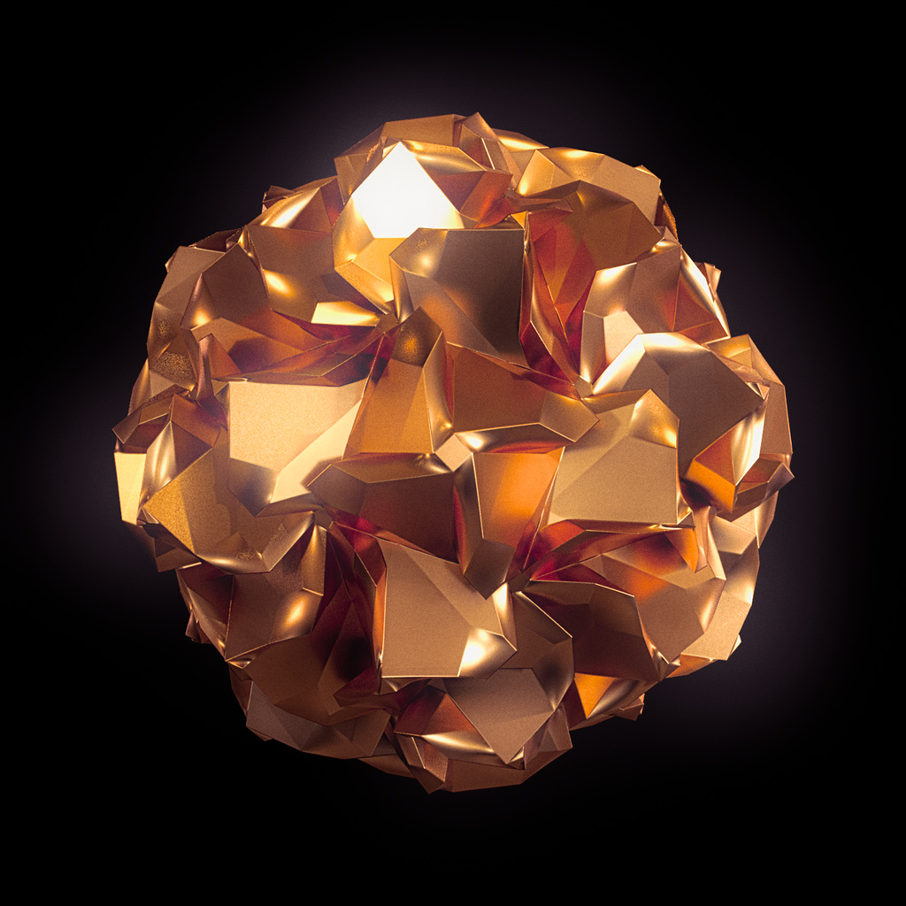
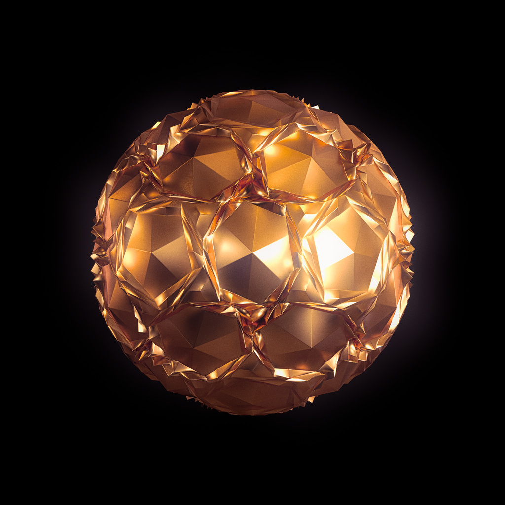

# Polyhedron Operators

This crate implements the [Conway Polyhedron
Operators](http://en.wikipedia.org/wiki/Conway_polyhedron_notation)
and their extensions by [George W. Hart](http://www.georgehart.com/)
and others.



*Some brutalist Polyhedron, rendered with
[3Delight|ɴsɪ](www.3delight.com) and post processed in
[Darktable](https://www.darktable.org/)*

This is an experiment to improve my understanding of iterators in Rust.
It is based on [Kit Wallace](http://kitwallace.tumblr.com/tagged/conway)’s
OpenSCAD code. As OpenSCAD Language is functional it lends itself
well to translation into functional Rust.

```rust
use polyhedron_ops::Polyhedron;
use std::path::Path;

// Conway notation: gapcD
let mut polyhedron =
    Polyhedron::dodecahedron()
        .chamfer(None, true)
        .propellor(None, true)
        .ambo(None, true)
        .gyro(None, None, true)
        .finalize();
// Export as ./polyhedron-gapcD.obj
polyhedron.export_as_obj(&Path::new("."), false);
```

The above code starts from a
[dodecahedron](https://en.wikipedia.org/wiki/Dodecahedron) and
iteratively applies three operators.

The resulting shape is shown below.



## Supported Operators

- [x] **a** - ambo
- [x] **b** - bevel (equiv. to **ta**)
- [x] **c** - chamfer
- [x] **d** - dual
- [x] **e** - expand (a.k.a. explode, equiv. to **aa**)
- [x] **g** - gyro
- [x] **j** - join (equiv. to **dad**)
- [x] **M** - medial (equiv. to **dta**)
- [x] **m** - meta (equiv. to **k,,3j**)
- [x] **o** - ortho (equiv. to **jj**)
- [x] **p** - propellor
- [x] **k** - kis
- [x] **q** - quinto
- [x] **r** - reflect
- [x] **s** - snub (equiv. to **dgd**)
- [x] **t** - truncate vertices (equiv. to *dkNd*)
- [x] **w** - whirl
- [x] **z** - zip (equiv. to **dk**)

### Other Operators (TBD)

- [ ] **i** - inset/loft
- [ ] **h** - hexpropellor
- [ ] **l** - stellate
- [ ] **x** - extrude
- [ ] **z** - triangulate
- [ ] **H** - hollow (called ’intrude‘ in Wings3D)

## Playing

There is a playground example app to test things & have fun:

```
cargo run --release --example playground --features="nsi"
```

### Keyboard Commands

Use keys matching the operator name from the above list to apply.

Use `Up` and `Down` to adjust the parameter of the the last operator.
Combine with `Shift` for 10× the change.

`Delete` undoes the last (and only the last) operation.

Press `Enter` to render with 3Delight (requires a [3Delight|ɴsɪ
installation](https://www.3delight.com/download)).
Combine with `Shift` to render with 3Delight Cloud (requires
registration).

Press `Space` to save as `$HOME/polyhedron-<type>.obj`.

I use `kiss3d` for realtime preview which is close to the metal enough
to limit meshes to 64k vertices. This means the preview will be broken
if your mesh hits this limit.

The app may crash though if your graphics driver doesn't handle such
ill-defined meshes gracefully. :)

Export & render will always yield a correct OBJ though. Which you can
view in Wings, Blender or another DCC app.
